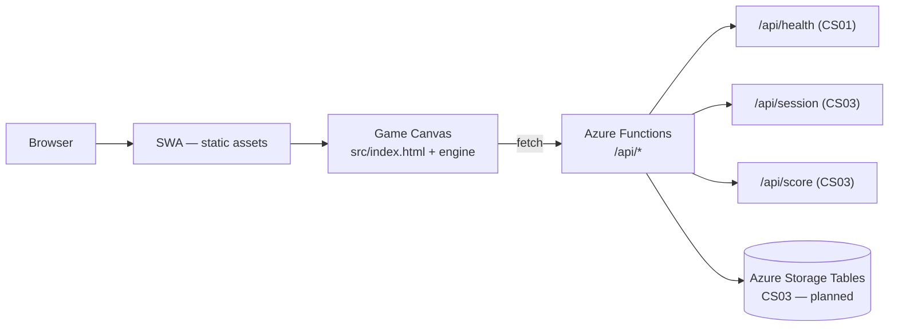

# Sub Invaders — Architecture

> **Last updated:** 2026-05-10 (cs01-architecture-author / CS01)
>
> **Purpose:** This file is created once by `harness init` and is never overwritten on subsequent
> syncs. It is the authoritative architecture reference for `henrik-me/sub-invaders`.

---

## Overview

Sub Invaders is a tiny browser-based, sea-themed Space Invaders game built on a custom in-tree
JavaScript engine, deployed to Azure Static Web Apps with a .NET 8 isolated Functions backend,
a persistent leaderboard, and a daily-challenge mode. The project is public (MIT licensed) and
governed by the `agent-harness` process model. CS01 ships the hardened repo skeleton and a first
staging deploy; CS02–CS04 complete the playable game, backend persistence, and daily-challenge
mode.

| Characteristic | Detail |
|---|---|
| Runtime / language (client) | HTML5 Canvas + ES2022 ESM `.mjs` modules; no bundler, no transpiler |
| Runtime / language (backend) | .NET 8 isolated worker (C# 12); Azure Functions v4 |
| Deployment target | Azure Static Web Apps managed Functions; RG `rg-sub-invaders-prod` |
| Primary consumers | Browser end-users; future leaderboard API clients |

---

## Components

### Frontend (`src/`)

Static `index.html` plus game and engine modules. In CS01 only `src/index.html` exists as a
"coming soon" placeholder; no JS modules, no canvas, no engine imports. CS02 replaces the stub
with the full game entrypoint.

### Engine (`src/engine/`, added in CS02)

Small custom canvas engine written as vanilla ES2022 `.mjs` modules. Contains only
game-agnostic primitives; zero Sub Invaders–specific knowledge. Modules:

| Module | Responsibility |
|---|---|
| `loop.mjs` | Fixed-timestep update + variable-rate `requestAnimationFrame` render |
| `entity.mjs` | Base `Entity` class: position, velocity, AABB, alive flag |
| `collision.mjs` | AABB overlap + group-vs-group query |
| `input.mjs` | Keyboard state + touch horizontal-drag delta |
| `renderer.mjs` | Canvas 2D wrapper: clear, `drawSprite`, `drawText`, fill/stroke rect |
| `sprite.mjs` | Sprite-sheet loader + frame animation clock |
| `audio.mjs` | `<audio>` element pool for SFX hooks |
| `scene.mjs` | Scene stack: push / pop / replace / current / update / render |
| `seed.mjs` | Mulberry32 seedable RNG: `seed(uint32)`, `next()`, `range(min, max)` |

The engine is structured for future extraction to a standalone repo
(placeholder: `henrik-me/canvas-game-engine`). The one-way dependency invariant is enforced
by a CI linter (`scripts/check-engine-isolation.mjs`): **engine modules must never import from
outside `src/engine/`.**

`src/engine/README.md` documents the full API surface and extraction contract.

Not present in CS01 — `src/engine/` contains only a `.gitkeep` sentinel.

### Game (`src/game/`, added in CS02)

Sub Invaders–specific gameplay: a 5×11 formation of sea enemies (jellyfish / anglerfish / giant
squid), a submarine player firing torpedoes, depth-charge physics, AABB collision, wave
progression, scoring, and a whale-shark mystery enemy (CS04). Imports engine modules; never
imported by engine. Not present in CS01.

### Backend (`api/`)

.NET 8 isolated Azure Functions project. CS01 delivers the scaffold and `HealthFunction.cs`
only. CS03 adds session, score, leaderboard, and cleanup Functions.

| Function | Route / trigger | Added |
|---|---|---|
| `HealthFunction.cs` | `GET /api/health` | CS01 |
| `SessionFunction.cs` | `POST /api/session` | CS03 |
| `ScoreFunction.cs` | `POST /api/score` | CS03 |
| `LeaderboardFunction.cs` | `GET /api/leaderboard` | CS03 |
| `SessionsCleanupFunction.cs` | Timer — hourly | CS03 |

### Persistence (planned, CS03)

Azure Storage Tables inside `rg-sub-invaders-prod`:

- **`Sessions`** — replay-protection token state (`PartitionKey=yyyyMMdd`, `RowKey=sessionId`).
  No Azure native TTL; hourly cleanup Function deletes rows older than 24 h.
- **`Leaderboard`** — scores (`PartitionKey="all"` for all-time;
  `PartitionKey="daily-YYYY-MM-DD"` for daily, added in CS04).
  RowKey format: `<invertedScore>_<submissionUuid>` for top-down read ordering.
  Capped to 10,000 rows by the cleanup Function.

SI-CS05 is a deferred tripwire to re-evaluate whether Storage Tables remains the right choice
once leaderboard load patterns are observable in staging.

### Infra (`infra/`)

- `provision.sh` — idempotent Azure provisioning: RG, Storage Account, SWA, Budget,
  Action Group. Enforces the `workload=sub-invaders` tag invariant before any operation.
- `main-protection-ruleset.json` — GitHub Repository Rulesets API request body for the
  `main-protection` ruleset applied to `henrik-me/sub-invaders`.

### Health probe + verify-deploy scaffolds (`health/`, `scripts/verify-deploy.mjs`)

Scaffolded by `harness init` from CS16 bootstrap. The verify-deploy smoke probe checks
`GET /` (200) and `GET /api/health` (200, body contains `status=ok`). Wired up fully in CS04.

### Feature-flags scaffold (`flags/`, `lib/feature-flags.mjs`)

Scaffolded by `harness init`. Frontend reads feature flags from
`<meta name="flags" content="key=value">`. Backend reads `FEATURE_FLAGS_*` environment
variables. Wired up in CS04 for the `dailyChallenge` flag.

---

## Engine vs. game split

The engine (`src/engine/`) and game (`src/game/`) live in disjoint directories by design:

- **Engine:** zero Sub Invaders–specific knowledge. Every module is game-agnostic and could
  serve a Pong, Breakout, or twin-stick shooter without modification.
- **Game:** imports engine modules freely; owns all gameplay state, scenes, and art references.
- **No reverse imports:** the engine MUST NOT import from `src/game/` or any path outside
  `src/engine/`. This invariant is the extraction contract. Violations are caught by
  `scripts/check-engine-isolation.mjs` which runs in `ci.yml`.

> **LRN candidate:** if a reverse import is ever introduced, file a learning immediately.
> The invariant is the foundation of the engine's value as an extractable primitive.

Both layers are hand-authored ES2022 `.mjs` modules. No bundler is used in v1; the browser
loads modules natively via `<script type="module">`. This matches C16-10 and C16-11.

---

## Backend / API model

- **Runtime:** .NET 8 isolated worker. NOT the legacy in-process model (which sunsets
  2026-11-10). Runs as a SWA managed Functions app — no separate Function App resource needed.
- **Language:** C# 12.
- **Project layout:** `api/Sub-invaders.Api.csproj` targets `net8.0`,
  `<AzureFunctionsVersion>v4</AzureFunctionsVersion>`, `<OutputType>Exe</OutputType>`.
  Functions use the `[Function]` attribute (C16-15).

### Routes

| Route | CS | Description |
|---|---|---|
| `GET /api/health` | CS01 | Returns `{"status":"ok"}` HTTP 200. Trivial liveness probe. |
| `POST /api/session` | CS03 | Issues a one-time session token. Rate-limited 30/min/IP. |
| `POST /api/score` | CS03 | Accepts score + session token; applies plausibility checks. Rate-limited 30/min/IP. |
| `GET /api/leaderboard` | CS03 | Returns top-100 all-time scores; `period=daily` added in CS04. |

### Replay protection (C16-12, implemented in CS03)

Triple guard against adversarial score submission:

1. **Session token:** `POST /api/session` generates a UUID + nonce + `startedAt` timestamp,
   persisted to the `Sessions` table. Client must present the token on score submission.
2. **Plausibility window:** server validates `finishedAt - startedAt` is between 10 s and 600 s,
   and `score <= elapsedSeconds × MAX_SCORE_PER_SECOND` (default 50).
3. **Per-IP rate limit:** sliding-window, 30 req/min, applied to both `/api/session` and
   `/api/score` before any Storage call.

Request bodies are bounded to 1 KB. Only `sessionId`, `score`, and `finishedAt` are accepted;
extra fields are rejected with HTTP 400. Session tokens are consumed atomically (idempotency
mark) to prevent replay.

> **CS01 note:** no rate limiter is implemented in CS01 because only `/api/health` exists
> (CS01-8). The defaults above are documented now and will be activated in CS03.

---

## Azure topology

- **Subscription:** the user's personal Azure subscription (confirmed at CS16 claim, gate G1).
- **Resource group:** `rg-sub-invaders-prod` — every Sub Invaders Azure resource lives inside
  this RG (C16-14, CS01-6).

> **Hard isolation invariant:** no Sub Invaders resource may be created outside
> `rg-sub-invaders-prod`. Cleanup is a single command:
> `az group delete --name rg-sub-invaders-prod --yes --no-wait`
> This removes 100% of the Sub Invaders Azure footprint with no orphans.

### Idempotency-via-tag (C16-14)

`provision.sh` MUST verify the RG carries tag `workload=sub-invaders` before any other
operation. If the tag is absent the script fails closed. On first run the RG is created
with `az group create` as its first action, carrying the tag immediately.

### Resource inventory

| Resource | Default name | Type | Notes |
|---|---|---|---|
| Resource group | `rg-sub-invaders-prod` | `Microsoft.Resources/resourceGroups` | Tag `workload=sub-invaders` required |
| Storage account | `stsubinvaders$RAND6` | `Microsoft.Storage/storageAccounts` | CS01-5: lowercase, no dashes, ≤24 chars; env override `STORAGE_ACCT_NAME` |
| Static Web App | `swa-sub-invaders` | `Microsoft.Web/staticSites` | Free SKU; deployed via SWA token (G5 secret) |
| Action group | `ag-sub-invaders-budget` | `Microsoft.Insights/actionGroups` | Email recipients receive budget alerts |
| Budget | `budget-sub-invaders-monthly` | `Microsoft.Consumption/budgets` | RG-scoped, $5 cap (CS01-7); alerts at 50/80/100% |

### Env-var override surface

All defaults are overridable at `provision.sh` invocation time:

`RG_NAME`, `RG_LOCATION`, `STORAGE_ACCT_NAME`, `SWA_NAME`, `BUDGET_AMOUNT`,
`BUDGET_ALERT_EMAIL`

### Cleanup contract

`az group delete --name rg-sub-invaders-prod --yes --no-wait` is the complete teardown.
No resources exist outside the RG; no manual sweeps required.

---

## Data model

CS01 has no persistent application data — the stub frontend is static HTML and the only
backend endpoint is `GET /api/health`, which returns the constant string `{"status":"ok"}`
with no storage I/O. The Azure Storage Account provisioned by `infra/provision.sh` is
required by the Functions runtime (`AzureWebJobsStorage`) but is not used by application
code in this CS.

Forward-looking shape (filled out by CS03 — see the Persistence subsection under
**Components** for the full key schema and replay-protection model):

| Table | Partition key | Row key | Purpose | Cleanup |
|---|---|---|---|---|
| `Scores` | `leaderboard` | `inverseScore_sessionId` | Top-N leaderboard rows | RG-level retention |
| `Sessions` | `session` | `sessionId` | Replay-protection nonces (C16-12) | Hourly `SessionsCleanupFunction` (Azure Tables `_ts` does not auto-delete) |

CS01 ships none of these tables — the schema lives here as forward-scope documentation so
CS03 agents know the contract before they start implementing it.

---

## Hosting / deploy model

Static assets and Functions deploy together through SWA managed Functions. There is no
separate Function App resource; the SWA pipeline handles both layers.

- **Trigger:** `.github/workflows/swa-deploy.yml` — push to `main` and PR preview.
- **Secret:** `AZURE_STATIC_WEB_APPS_API_TOKEN` (gate G5; stored in GitHub Actions secrets;
  never committed or logged).
- **Smoke probe:** verify-deploy scaffold checks `GET /` (HTTP 200) and
  `GET /api/health` (HTTP 200, body `{"status":"ok"}`).

---

## CI / CD pipeline

### `ci.yml`

Node 20 + .NET 8 SDK matrix. Jobs run on every PR and push to `main`:

| Job | Command |
|---|---|
| `harness-lint` | `harness lint --quiet` |
| `harness-sync-check` | `harness sync --mode=check` |
| `js-tests` | `node --test src/**/*.test.mjs` |
| `dotnet-tests` | `dotnet test api/` |

### `swa-deploy.yml`

Deploys to Azure Static Web Apps. Depends on G5 secret
(`AZURE_STATIC_WEB_APPS_API_TOKEN`). Committed **unguarded** by design
(C16-16, CS01-9 as implemented): before G5 the deploy job fails with a
`deployment_token was not provided` error. The failure is informational —
it surfaces the missing-secret state on every PR run so the gate cannot be
silently forgotten — and `swa-deploy/build-and-deploy` is intentionally
**not** part of the Ruleset's required-status-checks list, so this expected
failure does not block PR merge.

### `workboard-auto-approve.yml`

Validates that `workboard-only`-labeled PRs touch only the path allowlist
(`WORKBOARD.md`, `project/clickstops/{planned,active,done}/**`) and come from
an approved author. Posts a "ready for App auto-approve" comment on success
and an explanatory comment on failure. **Approval and squash-merge are
performed by the `workboard-auto-approve` GitHub App (gate G3), not by this
workflow** — GitHub Actions' built-in `GITHUB_TOKEN` cannot create approving
PR reviews. Permissions: `contents: read`, `pull-requests: write`.

### `dependabot.yml`

Weekly cadence for `npm`, `nuget`, and `github-actions` (CS01-4).

---

## Repository hardening

- **Ruleset `main-protection`** (`infra/main-protection-ruleset.json`): pull request required,
  ≥1 approving review, conversation resolution, no force-push, no branch deletion, linear
  history, squash-only merge, explicit repository-admin bypass for owner override (CS01-1,
  C16-13).
- **Required status checks (CS01-2):** the five contexts wired through CI —
  `ci`, `harness-lint`, `harness-sync-check`, `js-tests`, `dotnet-tests`.
  Workflow-pin enforcement, PR-body checks, and commit-trailer checks are
  performed **inside** the `harness-lint` job by the harness CLI rather than
  as separate Ruleset contexts.
- **CodeQL:** default setup for JavaScript and C# (CS01-3). Analysis may take up to 24 h
  on first enable; enable in CS01, record API evidence immediately.
- **Secret scanning + push protection:** enabled (C16-13).
- **Dependabot:** alerts, security updates, and version updates for `npm`, `nuget`, and
  `github-actions` (CS01-4).
- **Private Vulnerability Reporting:** enabled (C16-13).

---

## Process / governance pointers

- **Live coordination:** [WORKBOARD.md](WORKBOARD.md)
- **Process docs:** [OPERATIONS.md](OPERATIONS.md), [CONVENTIONS.md](CONVENTIONS.md),
  [REVIEWS.md](REVIEWS.md), [LEARNINGS.md](LEARNINGS.md)
- **Planned:** `RETROSPECTIVES.md`, `TRACKING.md`
- **Three-PR shape per CS:** claim → content → close-out.
- **Project tag:** `agent_suffix=si`; orchestrator agent IDs follow `<machine-short>-si[-c<N>]`.
- **Co-author trailer required** on every commit:
  `Co-authored-by: Copilot <223556219+Copilot@users.noreply.github.com>`

---

## Future scope (CS02–CS04)

| CS | Adds |
|---|---|
| CS02 | Custom engine + minimal playable Sub Invaders; sprite sheet; `localStorage` high-score |
| CS03 | .NET 8 leaderboard backend; replay protection; Storage Tables persistence; leaderboard scene |
| CS04 | Daily challenge (5 modifiers); harness pin-bump (`harness sync --mode=apply`); whale-shark; feature-flags wired; health-check wired; v1 shipped |

**Deferred tripwires:**

- **SI-CS05 (re-eval persistence):** re-evaluate Storage Tables once leaderboard load patterns
  are observable in staging.
- **SI-CS06 (re-eval hosting):** re-evaluate Azure SWA + Functions vs. Cloudflare Pages +
  Workers once cost and cold-start data are available.

---

## Decision log

### CS01 decisions

| Decision | Choice | Rationale |
|---|---|---|
| CS01-1 — Ruleset API shape | Author `infra/main-protection-ruleset.json` as the Repository Rulesets API request body, mirroring the agent-harness CS15a `main-protection` shape | CS15a proved this shape; C16-13 requires standards parity |
| CS01-2 — Required checks in Ruleset | Require the five CI contexts: `ci`, `harness-lint`, `harness-sync-check`, `js-tests`, `dotnet-tests` (workflow-pin/PR-body/trailer enforcement runs inside `harness-lint`, not as separate Ruleset contexts) | Enforces contribution discipline while allowing project-specific workflow names; matches what the harness CLI actually runs |
| CS01-3 — Code scanning | GitHub CodeQL default setup for JavaScript and C#; no advanced CodeQL workflow unless unavailable | C16-13 calls for default setup; less YAML = less consumer-maintained security plumbing |
| CS01-4 — Dependabot | `.github/dependabot.yml` for `npm`, `nuget`, `github-actions`; weekly cadence; alerts and version updates enabled | Covers full stack: Node harness/tests, .NET Function, and Actions |
| CS01-5 — Storage account naming | Default `STORAGE_ACCT_NAME=stsubinvaders$RAND6`; lowercase, no dashes, max 24 chars; env override | Azure global uniqueness + C16-14; env override enables deterministic retries |
| CS01-6 — Azure resource group | Default `RG_NAME=rg-sub-invaders-prod`; script verifies tag `workload=sub-invaders` before any other resource operation | Hard isolation invariant and cleanup contract from C16-14 |
| CS01-7 — Budget | RG-scoped monthly Budget `budget-sub-invaders-monthly`, default cap $5, alerts at 50/80/100% via Action Group `ag-sub-invaders-budget` | Spend guardrail is part of first provisioning, not an afterthought |
| CS01-8 — Rate-limit defaults documented now | Document 30/min defaults for `/api/session` and `/api/score`; implement no rate limiter in CS01 because only `/api/health` exists | Keeps ARCHITECTURE.md ready for CS03 without unused backend code |
| CS01-9 — Deploy workflow | Commit `swa-deploy.yml` **unguarded**: the deploy job runs on every push/PR and fails with a `deployment_token was not provided` error until G5 is complete. The failure is informational and is excluded from the Ruleset's required-status-checks list, so it does not block merges. (Original plan called for an `if: secrets.AZURE_STATIC_WEB_APPS_API_TOKEN != ''` guard; the implementer deviated to keep the gate visible — see the file header comment in `.github/workflows/swa-deploy.yml`.) | Visible failure surfaces the missing G5 token on every PR run; an `if:` guard would silently skip and the gate could be forgotten |
| CS01-10 — Stub backend response | `GET /api/health` returns HTTP 200 + JSON `{"status":"ok"}`; version/flag fields deferred | Minimal stable probe for SWA staging and verify-deploy scaffold |
| CS01-11 — Stub frontend | `src/index.html` is static HTML only; no JS modules, canvas, engine imports, or localStorage | Avoids stealing CS02 scope |
| CS01-12 — CHANGELOG pilot | Add a dated SI-CS01 entry to `CHANGELOG.md` | Carries forward the LRN-101 pilot pattern from CS16 |

### CS16 technology decisions (C16-9 through C16-16)

CS16 decisions C16-1..C16-16 are normative for sub-invaders; reference
https://github.com/henrik-me/agent-harness/blob/main/project/clickstops/active/active_cs16_bootstrap-sub-invaders/active_cs16_bootstrap-sub-invaders.md#decisions-cs16-specific-locked-in-2026-05-10.

The technology decisions most relevant to this document:

| Decision | Choice | Rationale |
|---|---|---|
| C16-9 — Backend tech | Azure Functions (.NET 8 isolated worker), SWA-managed Functions, route `/api/*` | User directive ".net"; isolated model is current Microsoft recommendation; in-process sunsets 2026-11-10 |
| C16-10 — Frontend tech | Vanilla JS ES2022, HTML5 Canvas, browser-native ES modules; no bundler, no transpiler, no TypeScript; zero browser runtime deps | User directive "Keep it simple"; native ES modules in 2026 cover all needs |
| C16-11 — Game engine | Custom in-tree at `src/engine/`; zero `import` from `src/engine/` to anything outside; structured for future extraction | User directive to build an extractable engine; one-way dep is the extraction contract |
| C16-12 — Replay protection | Server-issued session token + plausibility window + per-IP rate limit; bounded 1 KB payloads; explicit cleanup Function for session expiry (no Azure Tables native TTL) | "Keep it simple" + anti-cheat; session token is simplest design that survives basic adversarial submission |
| C16-13 — Repo standards parity | Mirror harness Ruleset shape, GitHub App install, security posture, and contribution docs | User directive: "ensuring it follows the same standards as the harness project itself" |
| C16-14 — Azure resource isolation | All Sub Invaders Azure resources in one dedicated RG `rg-sub-invaders-prod`; tag `workload=sub-invaders` required; cleanup is single `az group delete` | User directive: "separate resource group, SI, for everything in Azure for this game" |
| C16-15 — Function dev model | `api/` directory; `host.json`, `local.settings.json.example`, `Sub-invaders.Api.csproj`, `net8.0`, Functions v4, `OutputType=Exe` | Standard SWA + .NET 8 isolated layout; minimum surprise for contributors |
| C16-16 — CI matrix | Node 20 + .NET 8 SDK; `harness lint`, `harness sync --mode=check`, `node --test`, `dotnet test`; `swa-deploy.yml` guarded until G5 | Mirrors harness CI shape across full stack |
