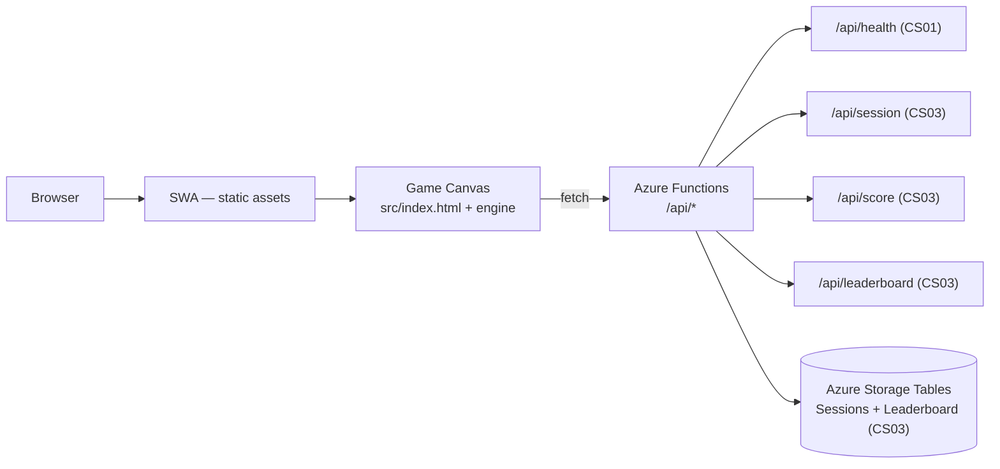

# Sub Invaders — Architecture

> **Last updated:** 2026-07-02 (omni-si / CS19 — ARCHITECTURE.md refresh)
>
> **Purpose:** This file is created once by `harness init` and is never overwritten on subsequent
> syncs. It is the authoritative architecture reference for `henrik-me/sub-invaders`.

---

## Overview

Sub Invaders is a tiny browser-based, sea-themed Space Invaders game built on the external
`canvas-game-engine` package (extracted from this repo in CS13, consumed at pinned tag `v0.1.0`),
deployed to Azure Static Web Apps with a .NET 8 isolated Functions backend, a persistent
leaderboard, and a daily-challenge mode. The project is public (MIT licensed) and governed by the
`agent-harness` process model. CS01 ships the hardened repo skeleton and a first staging deploy;
CS02–CS04 complete the playable game, backend persistence, and daily-challenge mode.

| Characteristic | Detail |
|---|---|
| Runtime / language (client) | HTML5 Canvas + ES2022 ESM `.mjs` modules, bundled by esbuild (CS14), no transpiler/TypeScript |
| Runtime / language (backend) | .NET 8 isolated worker (C# 12); Azure Functions v4 |
| Deployment target | Azure Static Web Apps managed Functions; RG `rg-sub-invaders-prod` |
| Primary consumers | Browser end-users; future leaderboard API clients |

---

## Components

### Frontend (`src/`)

Static `index.html` plus game and engine modules. In CS01 only `src/index.html` exists as a
"coming soon" placeholder; no JS modules, no canvas, no engine imports. CS02 replaces the stub
with the full game entrypoint.

### Engine (`canvas-game-engine`, extracted in CS13)

Small custom Canvas 2D engine written as vanilla ES2022 `.mjs` modules. Contains only
game-agnostic primitives; zero Sub Invaders–specific knowledge. As of CS13 the engine lives in
the standalone public repo `henrik-me/canvas-game-engine` and sub-invaders consumes it as an
external dependency (`github:henrik-me/canvas-game-engine#v0.1.0`); game code imports the
bundler-resolved bare specifiers `canvas-game-engine/<module>.mjs`. The nine-module surface:

| Module | Responsibility |
|---|---|
| `loop.mjs` | Fixed-timestep update + variable-rate `requestAnimationFrame` render |
| `entity.mjs` | Base `Entity` class: position, velocity, AABB, alive flag |
| `collision.mjs` | AABB overlap + group-vs-group query |
| `input.mjs` | Keyboard state + touch horizontal-drag delta |
| `renderer.mjs` | Canvas 2D wrapper: clear, `drawSprite`, `drawText`, fill/stroke rect |
| `sprite.mjs` | Sprite-sheet loader + frame animation clock |
| `audio.mjs` | `<audio>` element pool for SFX hooks |
| `scene.mjs` | Scene stack: push / pop / replace / current / update / render |
| `seed.mjs` | Mulberry32 seedable RNG: `seed(uint32)`, `next()`, `range(min, max)` |

Through CS12 the engine was vendored in-tree and its one-way dependency invariant was enforced by
an in-repo CI linter; CS13 extracted it to the standalone repo. That invariant — engine modules
must never import from a consumer — is now owned and CI-enforced by the upstream
`canvas-game-engine` repo. The full API surface and extraction contract live in the upstream
README: [`canvas-game-engine` README](https://github.com/henrik-me/canvas-game-engine/blob/v0.1.0/README.md).

### Game (`src/game/`, added in CS02)

Sub Invaders–specific gameplay: a 5×11 formation of sea enemies (jellyfish / anglerfish / giant
squid), a submarine player firing torpedoes, depth-charge physics, AABB collision, wave
progression, scoring, and a whale-shark mystery enemy (CS04). Imports engine modules; never
imported by engine. Not present in CS01.

### Backend (`api/`)

.NET 8 isolated Azure Functions project. CS01 delivers the scaffold and `HealthFunction.cs`
only. CS03 adds session, score, leaderboard, and cleanup Functions.

| Function | Route / trigger | Added |
|---|---|---|
| `HealthFunction.cs` | `GET /api/health` | CS01 |
| `SessionFunction.cs` | `POST /api/session` | CS03 |
| `ScoreFunction.cs` | `POST /api/score` | CS03 |
| `LeaderboardFunction.cs` | `GET /api/leaderboard` | CS03 |
| `SessionsCleanupFunction.cs` | `POST /api/admin/sessions-cleanup` (function key) | CS03 |

### Persistence (CS03 — implemented)

Azure Storage Tables inside `rg-sub-invaders-prod`. Tables are created idempotently by
`infra/provision.sh` Phase 2.5 (`az storage table create` with stderr-`grep` fallback for
`TableAlreadyExists` so re-runs are no-ops):

- **`Sessions`** — replay-protection token state. `PartitionKey = yyyyMMdd` (UTC date,
  shards Sessions across days so the hourly cleanup query stays cheap); `RowKey = sessionId`
  (cryptographically random GUID). Columns: `Nonce`, `StartedAt`, `Consumed`, `ConsumedAt`.
  Single-use; the score-submission path performs an ETag-conditional
  `UpdateEntityAsync(Replace)` so the second concurrent submitter receives 412 → mapped to
  HTTP 409 `already_consumed`. Azure Tables has no native TTL; cleanup is performed by the
  admin Function `POST /api/admin/sessions-cleanup` (`AuthorizationLevel.Function`), which
  deletes rows older than 24 h. SWA managed Functions does not support `timerTrigger`
  ('Currently, only httpTriggers are supported.'), so the cron schedule is driven externally
  (Azure Logic App / GitHub Actions cron) invoking the admin endpoint with the function key.
- **`Leaderboard`** — top scores. `PartitionKey = "all"` for all-time scores (single hot
  partition acceptable up to ~10k rows per the Azure Tables guidance) and
  `daily-YYYY-MM-DD` for daily scores. The date suffix is validated as a real UTC
  calendar date before routing. `RowKey = <invertedScore D8>_<submissionUuid>` where
  `invertedScore = 99_999_999 - score` zero-padded to 8 digits, so Table Storage's
  natural ascending row-key order returns top scores first. Columns: `Score` (int),
  `FinishedAt` (ISO-8601). Daily partitions are pruned by the cleanup Function after
  `DAILY_LEADERBOARD_RETENTION_DAYS` days (default 30); the all-time partition is never
  touched by the daily-retention pass.

SI-CS05 is a deferred tripwire to re-evaluate whether Storage Tables remains the right choice
once leaderboard load patterns are observable in staging.

### Infra (`infra/`)

- `provision.sh` — idempotent Azure provisioning: RG, Storage Account, SWA, Budget,
  Action Group. Enforces the `workload=sub-invaders` tag invariant before any operation.
- `main-protection-ruleset.json` — GitHub Repository Rulesets API request body for the
  `main-protection` ruleset applied to `henrik-me/sub-invaders`.

### Health probe + verify-deploy scaffolds (`health/`, `scripts/verify-deploy.mjs`)

Scaffolded by `harness init` during the initial bootstrap. The verify-deploy smoke probe checks
`GET /` (200) and `GET /api/health` (200, body contains `status=ok`). Wired up fully in CS04.

### Feature-flags scaffold (`flags/`, `lib/feature-flags.mjs`)

Scaffolded by `harness init`. Frontend reads feature flags from
`<meta name="flags" content="key=value">`. Backend reads `FEATURE_FLAGS_*` environment
variables. Wired up in CS04 for the `dailyChallenge` flag.

---

## Engine vs. game split

The engine (external `canvas-game-engine` package) and the game (`src/game/`) are cleanly
separated by design:

- **Engine:** zero Sub Invaders–specific knowledge. Every module is game-agnostic and could
  serve a Pong, Breakout, or twin-stick shooter without modification. Extracted to
  `henrik-me/canvas-game-engine` in CS13 and consumed at pinned tag `v0.1.0`.
- **Game:** imports engine modules freely as `canvas-game-engine/<module>.mjs` bare specifiers;
  owns all gameplay state, scenes, and art references.
- **No reverse imports:** the engine MUST NOT import from any consumer (including `src/game/`).
  This invariant is the extraction contract. As of CS13 it is owned and CI-enforced by the
  upstream `canvas-game-engine` repo; sub-invaders consumes a pinned tag and no longer carries an
  in-repo isolation linter.

> **LRN candidate:** if a reverse import is ever introduced upstream, file a learning
> immediately. The invariant is the foundation of the engine's value as a reusable primitive.

Both layers are hand-authored ES2022 `.mjs` modules. Since CS14, esbuild bundles the game
entrypoint — resolving both the relative `src/` graph and the `canvas-game-engine` bare
specifiers — into `src/dist/`, which the browser loads as an ES module (see LRN-025). This
realises the engine-extraction contract via the CS13 split.

---

## Backend / API model

- **Runtime:** .NET 8 isolated worker. NOT the legacy in-process model (which sunsets
  2026-11-10). Runs as a SWA managed Functions app — no separate Function App resource needed.
- **Language:** C# 12.
- **Project layout:** `api/Sub-invaders.Api.csproj` targets `net8.0`,
  `<AzureFunctionsVersion>v4</AzureFunctionsVersion>`, `<OutputType>Exe</OutputType>`.
  Functions use the `[Function]` attribute.

### Routes

| Route | CS | Description |
|---|---|---|
| `GET /api/health` | CS01 | Returns `{"status":"ok","version":"...","commit":"..."}` HTTP 200. Trivial liveness probe; surfaces deploy SHA from `SUB_INVADERS_COMMIT` or `GITHUB_SHA`. |
| `POST /api/session` | CS03 | Issues a one-time session token. Body ignored. Returns `{sessionId, nonce, startedAt}`. Rate-limited 30/min/IP. |
| `POST /api/score` | CS03 | Strict-JSON body `{sessionId, score, finishedAt}`; ≤ 1 KB. On accept returns `{status:"accepted", score, submissionId}`. Errors: 400 validation, 404 session_not_found, 409 already_consumed, 413 payload_too_large, 429 rate_limited. Rate-limited 30/min/IP. |
| `GET /api/leaderboard?period=all` | CS03 | Returns `{period, entries:[{rank,score,finishedAt}]}` (top 100, score desc). `period=daily` returns 501 in CS03; other values return 400. |

### CORS

The frontend is served by SWA on the same origin as `/api/*` (SWA managed Functions), so no
CORS preflight is needed in production. The local dev configuration runs `http-server src`
on `localhost:4173` and `func start` on `localhost:7071`; for that local cross-origin pairing
either run both behind a dev proxy or set the Functions worker's `Host.json` CORS to the
dev origin (do NOT widen permissive CORS in production).

### Cold start

SWA managed Functions on the Consumption plan show 1–3 s cold-start latency after idle
periods. This is acceptable for v1 (player presses Start, brief delay, game runs); the
session-establishment call is fire-and-forget from the play scene, so cold start does not
block the gameplay loop. If players consistently exceed the cold-start tolerance, the
Always-On Function App or Premium plan upgrade is the next step (cost trade-off; tracked
in SI-CS05).

### Rate limit caveats

The `RateLimitMiddleware` enforces a per-IP sliding window using an in-process
`SlidingWindowRateLimiter` (`Microsoft.AspNetCore.RateLimiting`). Two caveats:

1. **Per-instance, not global.** Each Functions worker instance keeps its own counter.
   During scale-out a determined adversary could submit up to `RATE_LIMIT_PER_MINUTE` per
   instance. v1 acceptable on Consumption plan (typically 1–2 instances); upgrade path is
   Azure Cache for Redis or Storage-backed counters, or front the API with APIM.
2. **Body buffering.** The Functions worker reads the entire request body before invoking
   the middleware, so the 1 KB `score` body cap is enforced at the application layer (in
   `ScoreFunction`) rather than at the wire layer. A `413 payload_too_large` is still
   returned for over-sized bodies, but the worker did read the full payload. If that
   threat model matters, add a Front Door / APIM body-size rule upstream.

### Replay protection (implemented in CS03)

Triple guard against adversarial score submission:

1. **Session token:** `POST /api/session` generates a UUID + nonce + `startedAt` timestamp,
   persisted to the `Sessions` table. Client must present the token on score submission.
2. **Plausibility windows:** server validates the payload shape (`finishedAt - startedAt`
   between 10 s and 600 s) and the submit wall-clock age (`serverNow - startedAt` between
   10 s and 900 s). The score cap is applied to `min(finishedAt-startedAt, serverNow-startedAt)`,
   so forged future `finishedAt` values cannot inflate the allowance. All-time scores use
   `MAX_SCORE_PER_SECOND` (default 50); daily scores use that cap multiplied by
   `DAILY_SCORE_MULTIPLIER_CAP` (default 4).
3. **Per-IP rate limit:** sliding-window, 30 req/min, applied to both `/api/session` and
   `/api/score` before any Storage call.

Request bodies are bounded to 1 KB. Only `sessionId`, `score`, and `finishedAt` are accepted;
extra fields are rejected with HTTP 400. Session tokens are consumed atomically via an
ETag-conditional `UpdateEntityAsync(Replace)` against the `Sessions` table (the
`Consumed` column flips false → true under the original ETag). The second concurrent
submitter for the same `sessionId` receives 412 from Table Storage, which is mapped to
HTTP 409 `already_consumed`.

> **Historical note (CS01):** no rate limiter was implemented in CS01 because only
> `/api/health` existed (CS01-8). CS03 activated the limiter on `/api/session` and
> `/api/score`; `/api/health` and `/api/leaderboard` remain unmetered.

---

## Azure topology

- **Subscription:** the user's personal Azure subscription (confirmed at bootstrap, gate G1).
- **Resource group:** `rg-sub-invaders-prod` — every Sub Invaders Azure resource lives inside
  this RG (CS01-6).

> **Hard isolation invariant:** no Sub Invaders resource may be created outside
> `rg-sub-invaders-prod`. Cleanup is a single command:
> `az group delete --name rg-sub-invaders-prod --yes --no-wait`
> This removes 100% of the Sub Invaders Azure footprint with no orphans.

### Idempotency-via-tag

`provision.sh` MUST verify the RG carries tag `workload=sub-invaders` before any other
operation. If the tag is absent the script fails closed. On first run the RG is created
with `az group create` as its first action, carrying the tag immediately.

### Resource inventory

| Resource | Default name | Type | Notes |
|---|---|---|---|
| Resource group | `rg-sub-invaders-prod` | `Microsoft.Resources/resourceGroups` | Tag `workload=sub-invaders` required |
| Storage account | `stsubinvaders$RAND6` | `Microsoft.Storage/storageAccounts` | CS01-5: lowercase, no dashes, ≤24 chars; env override `STORAGE_ACCT_NAME` |
| Static Web App | `swa-sub-invaders` | `Microsoft.Web/staticSites` | Free SKU; deployed via SWA token (G5 secret) |
| Action group | `ag-sub-invaders-budget` | `Microsoft.Insights/actionGroups` | Email recipients receive budget alerts |
| Budget | `budget-sub-invaders-monthly` | `Microsoft.Consumption/budgets` | RG-scoped, $5 cap (CS01-7); alerts at 50/80/100% |

### Env-var override surface

All defaults are overridable at `provision.sh` invocation time:

`RG_NAME`, `RG_LOCATION`, `STORAGE_ACCT_NAME`, `SWA_NAME`, `BUDGET_AMOUNT`,
`BUDGET_ALERT_EMAIL`

### Cleanup contract

`az group delete --name rg-sub-invaders-prod --yes --no-wait` is the complete teardown.
No resources exist outside the RG; no manual sweeps required.

---

## Data model

CS03 introduces the first persistent application data. CS01 had no persistent data — the
stub frontend was static HTML and `/api/health` does not touch storage. CS03 turns on
Azure Storage Tables inside the storage account `${STORAGE_ACCT_NAME}` (naming pattern
`stsubinvaders$RAND6`; the provisioned production instance is `stsubinvadersee1282`). The
connection string is wired to the SWA via the
**`SUB_INVADERS_STORAGE`** app setting (Program.cs reads `SUB_INVADERS_STORAGE` first
with fallback to `AzureWebJobsStorage` for local dev). The name `AzureWebJobsStorage`
**cannot** be used as a user app setting on SWA — the platform reserves it for the
SWA-internal Functions storage and rejects user values with HTTP 400. `infra/provision.sh`
Phase 3.5 sets `SUB_INVADERS_STORAGE` idempotently.

| Table | Partition key | Row key | Purpose | Cleanup |
|---|---|---|---|---|
| `Sessions` | `yyyyMMdd` (UTC day) | `sessionId` (GUID) | Replay-protection token + nonce. Columns: `Nonce`, `StartedAt`, `Consumed`, `ConsumedAt`. Single-use via ETag-conditional update. `Nonce` is currently reserved metadata; replay protection itself is keyed off `sessionId` consumption. | Admin Function `POST /api/admin/sessions-cleanup` (`AuthorizationLevel.Function`) deletes rows older than 24 h. Triggered by an external scheduler (SWA managed Functions does not support `timerTrigger`). Azure Tables has no native TTL. |
| `Leaderboard` | `"all"` or `daily-YYYY-MM-DD` | `<invertedScore D8>_<submissionUuid>` | Top scores. `invertedScore = 99_999_999 - score` so ascending RowKey sort returns top scores first. Columns: `Score` (int), `FinishedAt` (ISO-8601), `SessionId` (string, audit trail). Daily partition dates must be real UTC calendar dates. | Same admin cleanup Function trims all-time to `LeaderboardCap = 10 000` and deletes daily rows older than `DAILY_LEADERBOARD_RETENTION_DAYS` (default 30). |

Both tables are created idempotently by `infra/provision.sh` Phase 2.5 so a fresh deploy
into an empty RG produces a working backend without manual setup.

---

## Hosting / deploy model

Static assets and Functions deploy together through SWA managed Functions. There is no
separate Function App resource; the SWA pipeline handles both layers.

- **Trigger:** `.github/workflows/swa-deploy.yml` — push to `main` and PR preview.
- **Secret:** `AZURE_STATIC_WEB_APPS_API_TOKEN` (gate G5; stored in GitHub Actions secrets;
  never committed or logged).
- **Smoke probe:** verify-deploy scaffold checks `GET /` (HTTP 200),
  `GET /api/health` (HTTP 200, body `{"status":"ok"}`), and a session → score →
  leaderboard sequence that waits at least 10 seconds before submitting to satisfy the
  server-clock lower bound.
- **Cleanup scheduler:** `.github/workflows/sessions-cleanup.yml` runs hourly (`5 * * * *`)
  and posts to `https://happy-coast-04ffcaa1e.7.azurestaticapps.net/api/admin/sessions-cleanup`
  with the `x-functions-key` header. Manual step: create the repository Actions secret
  `SUB_INVADERS_FUNCTION_KEY` with the production Function key and rotate it periodically.
  The workflow logs a skip and exits 0 when the secret is absent.

---

## CI / CD pipeline

### `ci.yml`

Node 20 + .NET 8 SDK matrix. Jobs run on every PR and push to `main`:

| Job | Command / purpose |
|---|---|
| `harness-lint` | `npx -y "github:henrik-me/agent-harness#<version>" lint --quiet` (`<version>` read from `harness.config.json`; runs the schema, PR-body, workflow-pin, and commit-trailer checks via the pinned harness CLI) |
| `harness-sync-check` | `npx -y "github:henrik-me/agent-harness#<version>" sync --mode=check --cwd .` (fails on drift between the repo and the pinned harness templates) |
| `js-tests` | `npm ci`, then `node --test` over `src/**/*.test.mjs` + `scripts/**/*.test.mjs` |
| `dotnet-tests` | `dotnet restore api/` + `dotnet test api/ --configuration Release` |
| `coverage` | Unit coverage under c8 with suite thresholds (lines/statements/functions ≥ 90, branches ≥ 85) + per-file floors (`npm run coverage:check:unit`); then `npm run build` (frontend bundle) and `npm run test:e2e:coverage` (E2E coverage including the suite-level floor) |
| `ci` | Aggregate gate (`needs:` every job above); fails unless all required jobs succeeded. It is one of the six required status-check contexts in the Ruleset (see [Repository hardening](#repository-hardening)), not the only one |

### `swa-deploy.yml`

Deploys to Azure Static Web Apps. Depends on G5 secret
(`AZURE_STATIC_WEB_APPS_API_TOKEN`). Committed **unguarded** by design
(CS01-9 as implemented): before G5 the deploy job fails with a
`deployment_token was not provided` error. The failure is informational —
it surfaces the missing-secret state on every PR run so the gate cannot be
silently forgotten — and `swa-deploy/build-and-deploy` is intentionally
**not** part of the Ruleset's required-status-checks list, so this expected
failure does not block PR merge.

### `workboard-auto-approve.yml`

Validates that `workboard-only`-labeled PRs touch only the path allowlist
(`WORKBOARD.md`, `project/clickstops/{planned,active,done}/**`) and come from
an approved author. Posts a "ready for App auto-approve" comment on success
and an explanatory comment on failure. **Approval and squash-merge are
performed by the `workboard-auto-approve` GitHub App (gate G3), not by this
workflow** — GitHub Actions' built-in `GITHUB_TOKEN` cannot create approving
PR reviews. Permissions: `contents: read`, `pull-requests: write`.

### `dependabot.yml`

Weekly cadence for `npm`, `nuget`, and `github-actions` (CS01-4).

---

## Offline + modes (CS08)

CS08 adds offline play as a progressive enhancement and splits play into ranked
and practice modes. The Service Worker uses a small explicit static-asset
allowlist: `/`, `/index.html`, `/dist/main.mjs`, `/dist/main.mjs.map`,
`/public/sprites.png`, and `/public/sprites.licence`. Requests under `/api/*` are always network-only so
sessions, score submissions, health, and leaderboard reads never come from a
stale cache.

The deploy workflow injects the short commit SHA into the uploaded assets, and
`src/sw.mjs` names its cache `sub-invaders-<build-sha>`. On install the worker
calls `self.skipWaiting()`; on activation it deletes older `sub-invaders-*`
caches and claims clients with `clients.claim()` so a reload moves players onto
the newest asset set.

Ranked mode is the default data flow: it starts a `/api/session`, submits game
over scores to `/api/score`, and reads the leaderboard. Practice mode can be
selected with `?mode=practice` or the menu toggle; it never calls
`/api/session` or `/api/score`, keeps its best score in
`subInvadersPracticeHighScore`, and may still read the leaderboard as read-only
context.

Ranked submissions that fail due to network loss are queued in
`localStorage.subInvadersPendingScores`. The queue is a bounded FIFO with a cap
of 20 entries; draining retries the original submission and drops entries that
the backend rejects as `409` session-consumed or `400` expired, matching the
server replay-window contract instead of silently fabricating success.

Daily challenge and practice are mutually exclusive per CS08-14: daily implies
ranked, and switching to practice disables daily selection.

---

## Repository hardening

- **Ruleset `main-protection`** (`infra/main-protection-ruleset.json`): pull request required,
  ≥1 approving review, conversation resolution, no force-push, no branch deletion, linear
  history, squash-only merge, explicit repository-admin bypass for owner override (CS01-1).
- **Required status checks (CS01-2):** the six contexts required by
  `infra/main-protection-ruleset.json` — `ci`, `harness-lint`,
  `harness-sync-check`, `js-tests`, `dotnet-tests`, `e2e-local`.
  Workflow-pin enforcement, PR-body checks, and commit-trailer checks are
  performed **inside** the `harness-lint` job by the harness CLI rather than
  as separate Ruleset contexts.
- **CodeQL:** default setup enabled for `actions` and `javascript-typescript` (CS01-3).
  `csharp` is not auto-detected for the `api/` Azure Functions project on this repo;
  extending coverage via an advanced CodeQL workflow (or revisiting once GitHub
  detection improves) is a planned follow-up CS. Analysis may take up to 24 h on
  first enable.
- **Secret scanning + push protection:** enabled.
- **Dependabot:** alerts, security updates, and version updates for `npm`, `nuget`, and
  `github-actions` (CS01-4).
- **Private Vulnerability Reporting:** enabled.

---

## Process / governance pointers

- **Live coordination:** [WORKBOARD.md](WORKBOARD.md)
- **Process docs:** [OPERATIONS.md](OPERATIONS.md), [CONVENTIONS.md](CONVENTIONS.md),
  [REVIEWS.md](REVIEWS.md), [LEARNINGS.md](LEARNINGS.md)
- **Planned:** `RETROSPECTIVES.md`, `TRACKING.md`
- **Three-PR shape per CS:** claim → content → close-out.
- **Project tag:** `agent_suffix=si`; orchestrator agent IDs follow `<machine-short>-si[-c<N>]`.
- **Co-author trailer required** on every commit:
  `Co-authored-by: Copilot <223556219+Copilot@users.noreply.github.com>`

---

## Roadmap + deferred tripwires

The CS02–CS04 arc that delivered the playable v1 game is complete:

| CS | Adds | Status |
|---|---|---|
| CS02 | Custom engine + minimal playable Sub Invaders; sprite sheet; `localStorage` high-score | Done (2026-05-13) |
| CS03 | .NET 8 leaderboard backend; replay protection; Storage Tables persistence; leaderboard scene | Done (2026-05-13) |
| CS04 | Daily challenge (5 modifiers); date-seeded RNG; whale-shark; daily-partitioned leaderboard reads/writes; feature-flags wired (frontend + backend); health-check wired; **v1 shipped** | Done (2026-05-14) |

Post-v1 hardening and tooling has since shipped through CS18: E2E tests (CS07),
offline play + ranked/practice modes (CS08), coverage gates (CS09/CS15/CS18), engine
extraction to `canvas-game-engine` (CS13), the esbuild bundler (CS14), and the
production-deploy cancellation fix (CS17).

Note: CS04 retired the harness pin-bump exercise per CS04-13 (already validated by CS10/CS11/PR#62).

**Deferred tripwires:**

- **SI-CS05 (re-eval persistence):** re-evaluate Storage Tables once leaderboard load patterns
  are observable in staging.
- **SI-CS06 (re-eval hosting):** re-evaluate Azure SWA + Functions vs. Cloudflare Pages +
  Workers once cost and cold-start data are available.

---

## Decision log

### CS01 decisions

| Decision | Choice | Rationale |
|---|---|---|
| CS01-1 — Ruleset API shape | Author `infra/main-protection-ruleset.json` as the Repository Rulesets API request body, mirroring the agent-harness CS15a `main-protection` shape | CS15a proved this shape; harness standards parity requires it |
| CS01-2 — Required checks in Ruleset | Require the six CI contexts: `ci`, `harness-lint`, `harness-sync-check`, `js-tests`, `dotnet-tests`, `e2e-local` (workflow-pin/PR-body/trailer enforcement runs inside `harness-lint`, not as separate Ruleset contexts) | Enforces contribution discipline while allowing project-specific workflow names; matches what the harness CLI actually runs |
| CS01-3 — Code scanning | GitHub CodeQL default setup; configure for the languages GitHub auto-detects as eligible (`actions` + `javascript-typescript` on this repo). `csharp` is not auto-surfaced for the `api/` Functions project; planned follow-up CS to enable .NET coverage via advanced workflow if default detection still misses it. | harness standards parity calls for default setup; less YAML = less consumer-maintained security plumbing |
| CS01-4 — Dependabot | `.github/dependabot.yml` for `npm`, `nuget`, `github-actions`; weekly cadence; alerts and version updates enabled | Covers full stack: Node harness/tests, .NET Function, and Actions |
| CS01-5 — Storage account naming | Default `STORAGE_ACCT_NAME=stsubinvaders$RAND6`; lowercase, no dashes, max 24 chars; env override | Azure global uniqueness + single-RG isolation; env override enables deterministic retries |
| CS01-6 — Azure resource group | Default `RG_NAME=rg-sub-invaders-prod`; script verifies tag `workload=sub-invaders` before any other resource operation | Hard isolation invariant and cleanup contract (single-RG isolation) |
| CS01-7 — Budget | RG-scoped monthly Budget `budget-sub-invaders-monthly`, default cap $5, alerts at 50/80/100% via Action Group `ag-sub-invaders-budget` | Spend guardrail is part of first provisioning, not an afterthought |
| CS01-8 — Rate-limit defaults documented now | Document 30/min defaults for `/api/session` and `/api/score`; implement no rate limiter in CS01 because only `/api/health` exists | Keeps ARCHITECTURE.md ready for CS03 without unused backend code |
| CS01-9 — Deploy workflow | Commit `swa-deploy.yml` **unguarded**: the deploy job runs on every push/PR and fails with a `deployment_token was not provided` error until G5 is complete. The failure is informational and is excluded from the Ruleset's required-status-checks list, so it does not block merges. (Original plan called for an `if: secrets.AZURE_STATIC_WEB_APPS_API_TOKEN != ''` guard; the implementer deviated to keep the gate visible — see the file header comment in `.github/workflows/swa-deploy.yml`.) | Visible failure surfaces the missing G5 token on every PR run; an `if:` guard would silently skip and the gate could be forgotten |
| CS01-10 — Stub backend response | `GET /api/health` returns HTTP 200 + JSON `{"status":"ok"}`; version/flag fields deferred | Minimal stable probe for SWA staging and verify-deploy scaffold |
| CS01-11 — Stub frontend | `src/index.html` is static HTML only; no JS modules, canvas, engine imports, or localStorage | Avoids stealing CS02 scope |
| CS01-12 — CHANGELOG pilot | Add a dated SI-CS01 entry to `CHANGELOG.md` | Carries forward the LRN-101 pilot pattern from the bootstrap |

> **Bootstrap provenance.** Sub Invaders' foundational technology decisions
> (backend, frontend, engine, replay protection, Azure resource isolation, CI)
> were made during the agent-harness–orchestrated bootstrap and are recorded in
> that repository's clickstop CS16:
> <https://github.com/henrik-me/agent-harness/blob/main/project/clickstops/done/done_cs16_bootstrap-sub-invaders/done_cs16_bootstrap-sub-invaders.md>.
> They are not reproduced here — this document records only sub-invaders' own
> architecture and decisions.

### CS04 decisions (locked-in 2026-05-14, R4 hash `eb9b647f8ece`)

| Decision | Choice | Rationale |
|---|---|---|
| CS04-3 — Daily seed | UTC-day index encoded as `parseInt('YYYYMMDD', 10)` and threaded into `createRng(seed)` | Same calendar day → identical run; simplest deterministic mapping; engine RNG already int-seeded |
| CS04-4 — Modifier draw | Single draw from a 5-element pool using the date-seeded RNG (`pick`); modifier name + 3 parameter rolls (`enemyFireMultiplier`, `formationSpeedMultiplier`, `whaleSharkInterval`) | One modifier per day keeps the run readable; parameter rolls inject variety without exploding state |
| CS04-5 — Modifier pool | `fog-of-war`, `speed-run`, `one-shot`, `boss-rush`, `inverted-controls` | Five orthogonal twists; each is a small mutator on existing scene state |
| CS04-6 — Whale-shark cadence | Crosses the playfield on a daily-drawn interval (10 / 15 / 20 / 30 s); placeholder rectangle in v1 (sprite slot reserved) | Bonus enemy adds variety without per-wave coordination |
| CS04-11 — Flag delivery | HTML `<meta name="flags">` default → `GET /api/health` body's `flags` override (1500 ms `AbortController` budget) → fall back to default on any failure | Static fallback keeps menu functional offline; backend override unblocks runtime kill-switch |
| CS04-13 — Pin-bump retirement | Drop the `harness sync --mode=apply` pin-bump exercise from CS04 scope | CS10/CS11/PR#62 already validated harness pin lifecycle |
| CS04-14 — Daily score payload contract | `submitScore({sessionId, score, finishedAt, period?, utcDate?})` and `getLeaderboard({period, date?})`. `period === 'daily'` requires `utcDate` matching `^\d{4}-\d{2}-\d{2}$`. Backend partition is `daily-YYYY-MM-DD`; all-time partition stays unchanged | Optional fields preserve CS03 back-compat bit-exact; explicit pattern guards bad input client-side |
| CS04-15 — Validation commands | `npm run test:unit`, `npm run test:e2e`, `dotnet test api/`, `node scripts/verify-deploy.mjs` (run twice — once with `dailyChallenge=off`, once with `dailyChallenge=on`) | Two-state matrix proves CS03 behaviour preserved AND daily mode reachable; there is no `npm test` script |

### CS08 decisions (offline play + modes, 2026-06-30)

| Decision | Choice | Rationale |
|---|---|---|
| CS08-9..CS08-13 — Offline asset cache | Service Worker caches only explicit static assets, keeps `/api/*` network-only, uses SHA-versioned `sub-invaders-<build-sha>` caches, deletes old caches on activate, and supports `?nosw=1` / localhost bypass | Keeps offline play predictable, makes deploy invalidation atomic, and avoids stale API data |
| CS08-14 — Practice + daily challenge | Practice and daily challenge are mutually exclusive; daily implies ranked | Daily fairness depends on a single official run per day |

### CS13 decision (engine extraction, 2026-06-30)

| Decision | Choice | Rationale |
|---|---|---|
| CS13-1 — Engine extraction | Move the in-tree `src/engine/` engine (9 modules: loop, entity, collision, input, renderer, sprite, audio, scene, seed) to the standalone public repo `henrik-me/canvas-game-engine` at tag `v0.1.0`; consume it as a git-URL dependency (`github:henrik-me/canvas-game-engine#v0.1.0`) imported as bundler-resolved `canvas-game-engine/<module>.mjs` bare specifiers; delete the vendored directory and the in-repo `scripts/check-engine-isolation.mjs` linter | Realises the engine-extractability contract — the engine becomes reusable across games and the one-way isolation invariant is now owned and CI-enforced upstream. Accepted tradeoff: engine changes require an upstream PR + tag bump + dependency-pin bump (round-trip) |

### CS14 decision (esbuild bundler, 2026-06-10)

| Decision | Choice | Rationale |
|---|---|---|
| CS14-1 — Frontend bundler | Introduce esbuild to bundle the game entrypoint `src/game/main.mjs` into `src/dist/main.mjs` — resolving both the relative `src/` module graph and the `canvas-game-engine` bare specifiers — which the browser loads as an ES module | Browsers cannot resolve bare package specifiers, so consuming the external engine requires a bundler; esbuild has the smallest footprint (single binary, ~20-line config, native ESM + sourcemaps) |

### CS15 decision (unit per-file coverage gate, 2026-06-16)

| Decision | Choice | Rationale |
|---|---|---|
| CS15-1 — Unit per-file floors in CI | Enforce per-file unit-coverage floors in CI via `npm run coverage:check:unit` (`scripts/coverage-perfile.mjs` reading the `unit` suite in `coverage-thresholds.json`) against the json-summary the c8 step already emits; close the gap by raising real coverage, not by lowering thresholds | The c8 step enforced only suite-level totals, so a single file could sit below floor while CI stayed green; per-file gating matches the shape the E2E suite already uses |

### CS17 decision (deploy push-cancellation fix, 2026-07-01)

| Decision | Choice | Rationale |
|---|---|---|
| CS17-2 — Deploy concurrency group | Event- and PR-number-qualify the `swa-deploy.yml` concurrency group (`swa-deploy-${{ github.event_name }}-${{ github.event.pull_request.number || github.ref }}`) so a `pull_request: closed` teardown run can no longer cancel the main-push production deploy | Push and PR-close runs previously shared one group; the PR run (`cancel-in-progress: true`) cancelled the in-progress push deploy, leaving prod stale until a manual re-run |

### CS18 decision (E2E suite-level coverage floor fatal, 2026-07-01)

| Decision | Choice | Rationale |
|---|---|---|
| CS18-2 — E2E suite floor enforcement | Enforce the E2E suite-level floors in a post-Playwright Node step (`scripts/coverage-suite.mjs`) that reads the emitted coverage summary and exits non-zero (fail-closed) on any breach of `coverage-thresholds.json`'s `e2e.suite` floors, wired into `npm run test:e2e:coverage` after the Playwright run | Playwright derives its exit code from test results, not a reporter's late `process.exitCode`, so the old monocart `onEnd` suite check was cosmetic; a dedicated post-step gives a reliable blocking gate |
